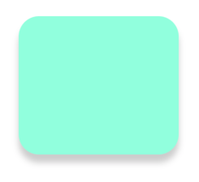

# ImageView-Radius-Shadow
IOS- UIImageView - cornerRadius and shadow

```
// set radius
imgView.layer.cornerRadius = 10
imgView.clipsToBounds = true

// set shadow
imgView.layer.shadowColor = UIColor.black.cgColor
imgView.layer.shadowOpacity = 0.2
imgView.layer.shadowOffset = CGSize(width: 0, height: 10)
imgView.layer.shadowRadius = 4
imgView.layer.masksToBounds = false
```

Result: it works! magic! unbelievable!
Please leave some comments if you know the reason!


